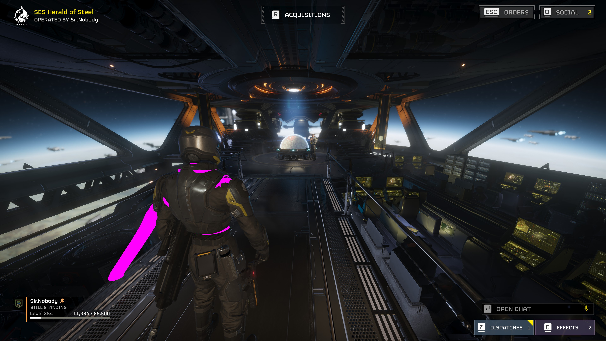
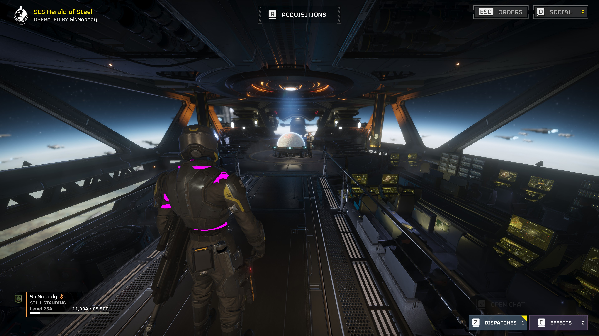
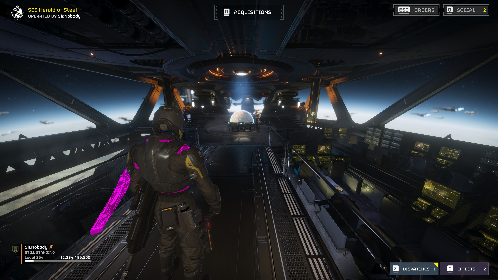

# Converted Inverse-Bind Live Validation

Date: 2026-09-14

## Verdict

Runtime skinning control through the loader-converted 48-byte inverse-bind table is established for the tested B-01 chest unit.

The add-on found four complete profile-B tables, changed slot 7 in all four from exact B bytes to exact A bytes, held the A state, and restored exact B. The visible slot-7-weighted geometry changed from the exaggerated displaced state to its normal position and returned to the displaced state after restoration. The game did not crash and the exact tested process shut down cleanly.

This is the first positive visual runtime-edit result in the project. It replaces the earlier upload-ring and `file64` write hypotheses with a verified control point.

## Controlled profile

| Field | Value |
| --- | --- |
| Patch | `9ba626afa44a3aa3.patch_0` |
| Unit | `fa269172bd08695b` |
| Slot | 7 (`l_shoulder` in the offline census) |
| A | original inverse bind |
| B | 1.5 m world-space displacement along negative X |
| Modified LODs | 0, 1, 2, 3 |
| Palette growth | none |
| Vertex reweighting | none |

Profile A main SHA-256:

```text
fb181c4f3d4beb6500eef50a0a94977b20a7388252dd4925265eb0d504f23d23
```

Profile B main SHA-256:

```text
7d8d0fa1c3203ffdc993aeaac925cf148c04c4f41dff0ab10f10b1994591110e
```

The GPU and stream resources were identical between A and B. The B patch remained 50,184 bytes. Forty-eight individual bytes changed, all inside slot 7's three-float translation rows in LODs 0 through 3.

The 1.5 m control was derived by scaling the already validated 0.15 m A/B translation difference by ten. `tools/scale_slot_control.py` verifies that every non-translation matrix component and every byte outside those target rows remains unchanged. `tools/build_ib_profile.py` then independently accepted the result as a no-growth A/B profile.

## Run 1: read-only converted-table discovery

Result directory: `test-results/20260914-014647`

Installed profile B used the initial 0.15 m control. The add-on found four full B tables and no full A table:

```text
status                 passed-converted-scan
converted_ib_hits      4
converted_ib_a_hits    0
converted_ib_b_hits    4
best partial match     87 / 88 entries
input sequence         walk, turn, stretch completed
shutdown               succeeded
```

This proved that the converted representation could be found read-only. It did not yet prove that an active draw consumed those allocations.

## Run 2: initial reversible edit

Result directory: `test-results/20260914-015311`

The 0.15 m B profile was switched to A and restored:

```text
status                 passed-converted-edit
targets selected       4
targets written        4
CPU matches            4
present readbacks      3,960
refills observed       0
targets restored       4
restore succeeded      true
shutdown succeeded     true
```

The byte-level result was positive. Its screenshots were not accepted as visual proof because the before frame was captured during the stretch animation while active and restored frames used later poses.

## Run 3: exaggerated fixed-camera B to A to B

Result directory: `test-results/20260914-015847`

The test used the 1.5 m B profile. Movement and stretch were deliberately skipped during the comparison. The camera remained behind the idle character, and the B/A/B captures occurred within approximately two seconds.

```text
status                 passed-converted-edit
experiment mode        converted_ib_edit
full B table hits      4
targets selected       4
targets written        4
CPU matches            4
present readbacks      532
refills observed       0
targets restored       4
restore succeeded      true
edit error             0
marker writes          0
animated-palette hits  0
shutdown succeeded     true
```

All four tables were consecutive instances inside one writable 64 KiB private allocation. Their run-specific addresses were:

```text
0x1f00bbe0080
0x1f00bbe1290
0x1f00bbe24a0
0x1f00bbe36b0
```

### Before: installed profile B

The left-shoulder-weighted geometry is displaced far to the left of the character.



### Active: converted tables switched to profile A

The long displaced geometry disappears and the arm/shoulder returns to its normal location.



### Restored: exact profile B bytes restored

The displaced geometry reappears after restoration.



The bright magenta material is not itself the pass condition. The pass is the large spatial displacement disappearing in A and reappearing in restored B while the camera and pose remain controlled.

## What this proves

- The four runtime allocations contain exact loader-converted inverse-bind tables for this unit's four 88-slot LODs.
- The existing character instance consumes these tables continuously enough for a live edit to affect rendering without equipment reload.
- The converted slot layout and translation placement are correct.
- A bounded B to A to B control loop can edit and restore all relevant LOD tables.
- Upload-ring editing is not required to deform the visible character.

## What this does not prove

- The four tables are not a global character armature. They belong to this skinned unit.
- Other armor/body units still require their own profile or a verified general locator.
- Slot semantics cannot be inferred from runtime matrices alone; the `l_shoulder` label came from offline patch structure.
- Hierarchy-aware multi-bone shoulder adjustment has not yet been implemented.
- The current exact whole-table matcher is profile-specific and not yet a general mod-independent discovery algorithm.

## Next stage

The mechanism-validation gate is passed. The next work can move to a controlled editing interface and semantic mapping:

1. retain exact profile matching as the validation fallback;
2. expose located unit/table instances and slot values without the legacy upload-ring terminology;
3. add bounded per-slot translation controls using the verified `t48` layout;
4. reconstruct names and parent relationships offline from patched unit metadata;
5. apply related shoulder/clavicle/twist edits together only after single-slot controls remain stable.

Runtime memory was restored before shutdown. After evidence collection, the installed game triplet was also restored to exact profile A so a later manual launch will use normal geometry.
